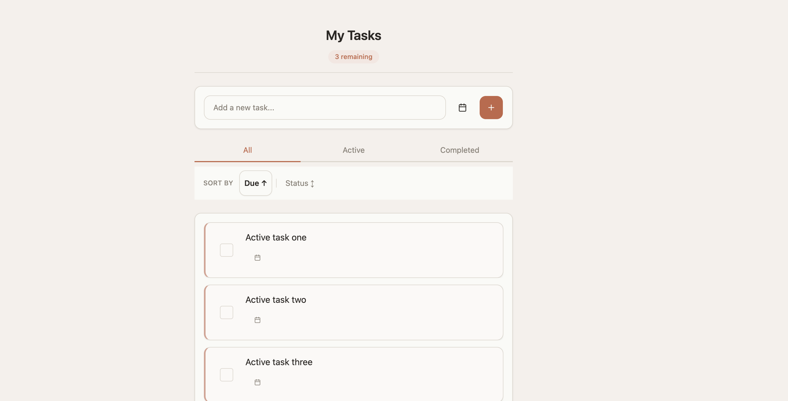

# My Tasks — Full-Stack Todo App

A clean, responsive personal task management application built with a modern TypeScript stack. Create, complete, sort, and filter your todos with optional due dates — all backed by a PostgreSQL database and deployable via Docker.



## Features

- **CRUD todos** — Add, complete, and delete tasks instantly
- **Due dates** — Attach optional due dates to any task via an inline date picker
- **Filter views** — Switch between All, Active, and Completed tabs
- **Sorting** — Sort by due date (soonest first) or by status (active first)
- **Undo delete** — Toast notification with undo action after deleting a task
- **Remaining counter** — Live count of active tasks in the header
- **Accessible** — Keyboard navigation, ARIA labels, responsive touch targets, reduced-motion support
- **Skeleton loading** — Graceful loading states with animated placeholders
- **Error banner** — Inline error display with retry capability

## Tech Stack

| Layer | Technology |
|-------|------------|
| **Frontend** | React 19, Vite 8, Tailwind CSS 4, TanStack Query 5 |
| **Backend** | Fastify 5, Zod 4, Drizzle ORM |
| **Database** | PostgreSQL 16 |
| **Language** | TypeScript (strict) throughout |
| **Monorepo** | pnpm workspaces |
| **Infra** | Docker Compose, nginx reverse proxy |
| **Quality** | Biome (lint + format), Vitest, Playwright, pre-commit hooks |

## Project Structure

```
bmad-todo-app/
├── packages/
│   ├── backend/          # Fastify REST API + Drizzle ORM
│   │   ├── src/
│   │   │   ├── routes/   # /api/todos CRUD endpoints
│   │   │   ├── schema/   # Drizzle schema + migrations
│   │   │   ├── plugins/  # DB connection plugin
│   │   │   ├── config/   # Zod-validated environment
│   │   │   └── scripts/  # Seed scripts
│   │   └── Dockerfile
│   └── frontend/         # React SPA
│       ├── src/
│       │   ├── components/  # Todo cards, filters, sort, input
│       │   ├── hooks/       # useTodos (TanStack Query)
│       │   └── lib/         # API client
│       ├── nginx.conf
│       └── Dockerfile
├── e2e/                  # Playwright end-to-end tests
├── secrets/              # Docker secret files (gitignored)
├── docker-compose.yml
└── biome.json
```

## Prerequisites

- **Node.js** 22+
- **pnpm** 10+ (`corepack enable` to use the pinned version)
- **Docker** & **Docker Compose** (for the database, or for full-stack deployment)

## Quick Start

### 1. Install dependencies

```bash
pnpm install
```

### 2. Configure environment

Copy the example and adjust if needed:

```bash
cp .env.example packages/backend/.env
```

Default values work out of the box for local development with the Docker-managed database.

### 3. Start developing

```bash
pnpm dev
```

This single command:
1. Starts PostgreSQL via Docker Compose
2. Launches the backend API on `http://localhost:3000` (with auto-reload)
3. Launches the frontend on `http://localhost:5173` (with HMR)

The Vite dev server proxies `/api` requests to the backend automatically.

### 4. Seed demo data (optional)

```bash
pnpm db:seed:demo
```

## Available Scripts

| Script | Description |
|--------|-------------|
| `pnpm dev` | Start DB container + all dev servers |
| `pnpm dev:app` | Start dev servers only (DB already running) |
| `pnpm dev:down` | Stop Docker containers |
| `pnpm build` | Build all packages for production |
| `pnpm lint` | Run Biome linter and formatter checks |
| `pnpm lint:fix` | Auto-fix lint and format issues |
| `pnpm test` | Run unit/integration tests across all packages |
| `pnpm test:e2e` | Run Playwright end-to-end tests |
| `pnpm db:seed:demo` | Seed the database with sample todos |

## Docker Deployment

For a full containerized stack (frontend + backend + database):

### 1. Create Docker secrets

```bash
mkdir -p secrets
printf '%s' 'postgres' > secrets/postgres_user.txt
printf '%s' 'change-me' > secrets/postgres_password.txt
```

### 2. Configure environment

Set these in `.env` or your shell environment:

| Variable | Default | Description |
|----------|---------|-------------|
| `POSTGRES_DB` | `bmad_todo` | Database name |
| `FRONTEND_PORT` | `8080` | Host port for the frontend |
| `ALLOWED_ORIGINS` | — | Comma-separated browser origins (required in production) |

### 3. Launch

```bash
docker compose up --build
```

The app is served at `http://localhost:8080` with nginx handling static assets and reverse-proxying `/api` to the backend. The backend runs migrations automatically on startup.

## API

The backend exposes a REST API with auto-generated Swagger documentation at `/documentation` when running in development mode.

| Method | Endpoint | Description |
|--------|----------|-------------|
| `GET` | `/api/todos` | List all todos |
| `POST` | `/api/todos` | Create a new todo |
| `PATCH` | `/api/todos/:id` | Update completion status or due date |
| `DELETE` | `/api/todos/:id` | Delete a todo |

## Testing

**Unit & integration tests** run with Vitest across both packages:

```bash
pnpm test
```

**End-to-end tests** run with Playwright against the full running stack:

```bash
pnpm test:e2e
```

The test suite covers CRUD operations, filtering, sorting, due dates, error states, accessibility, and responsive behavior.

## License

Private project — not published to any registry.
