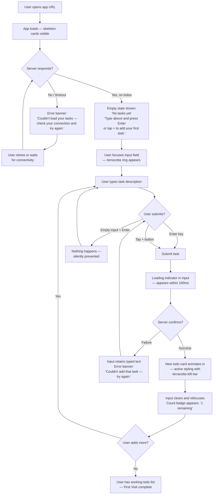
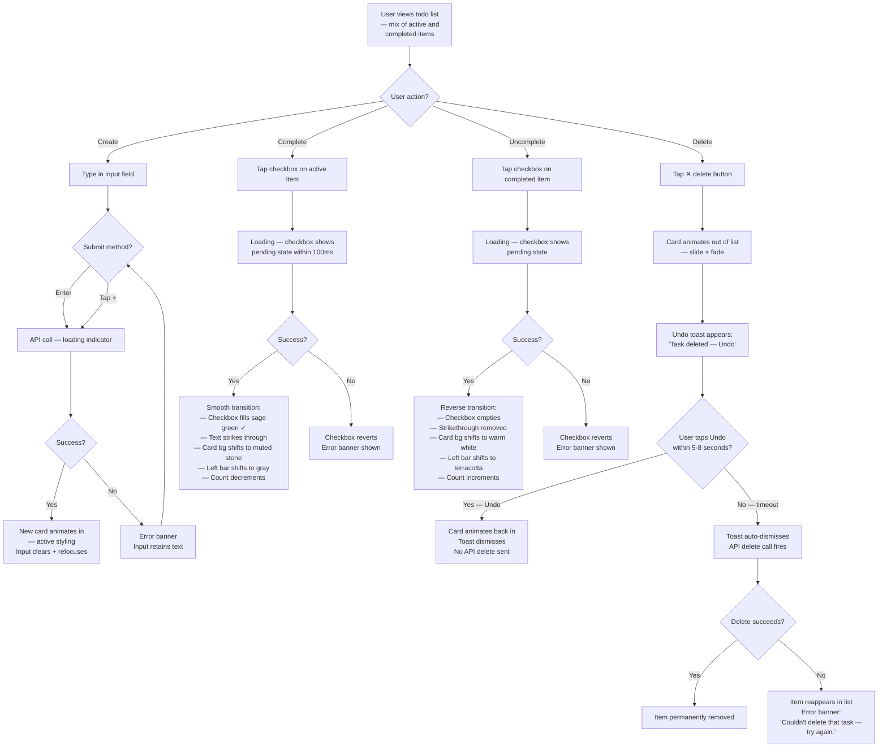
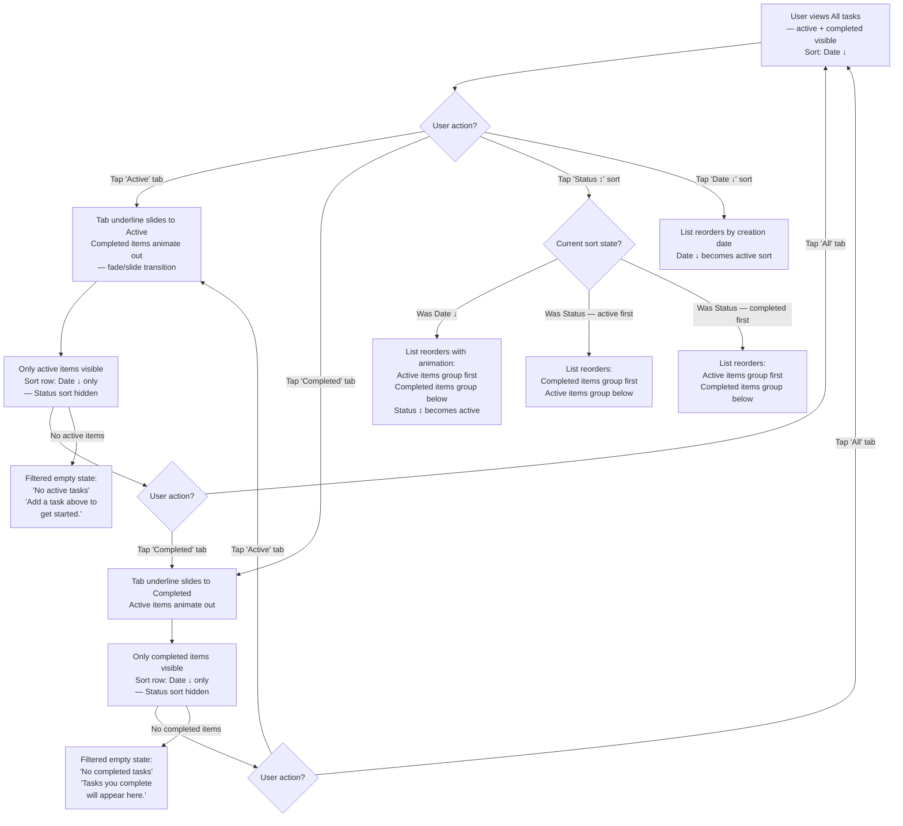
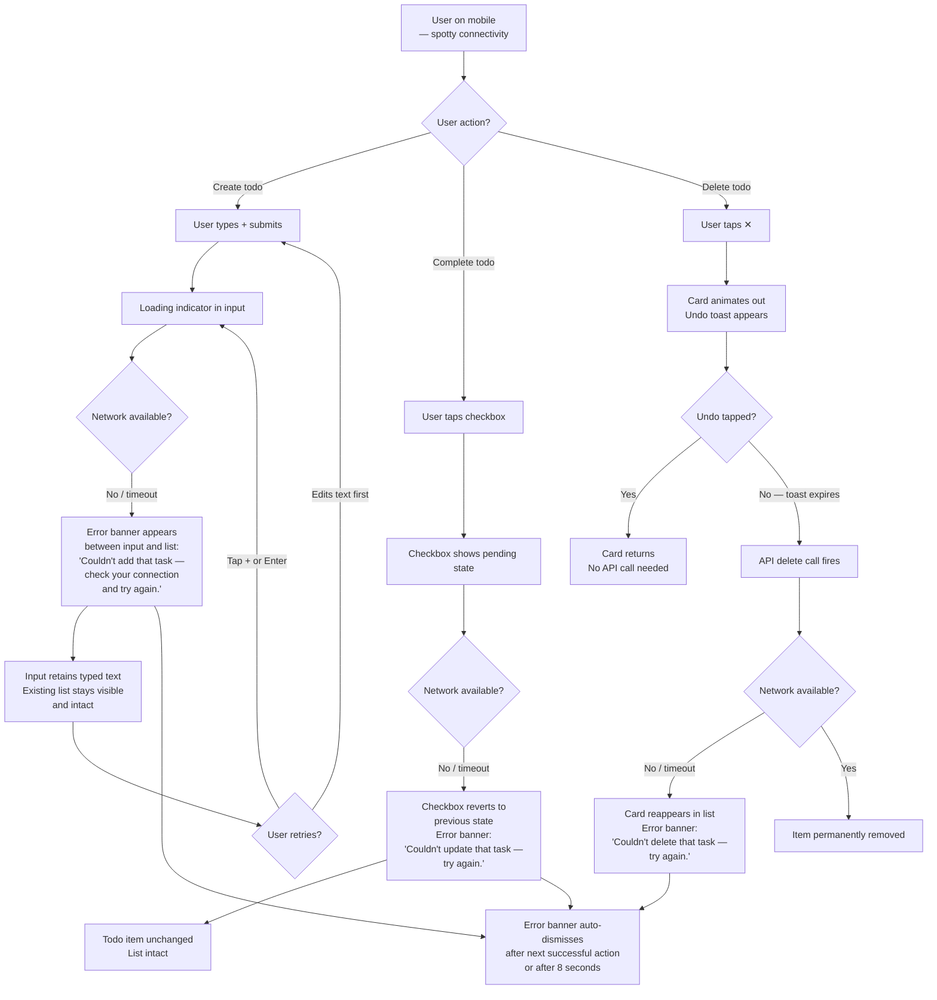
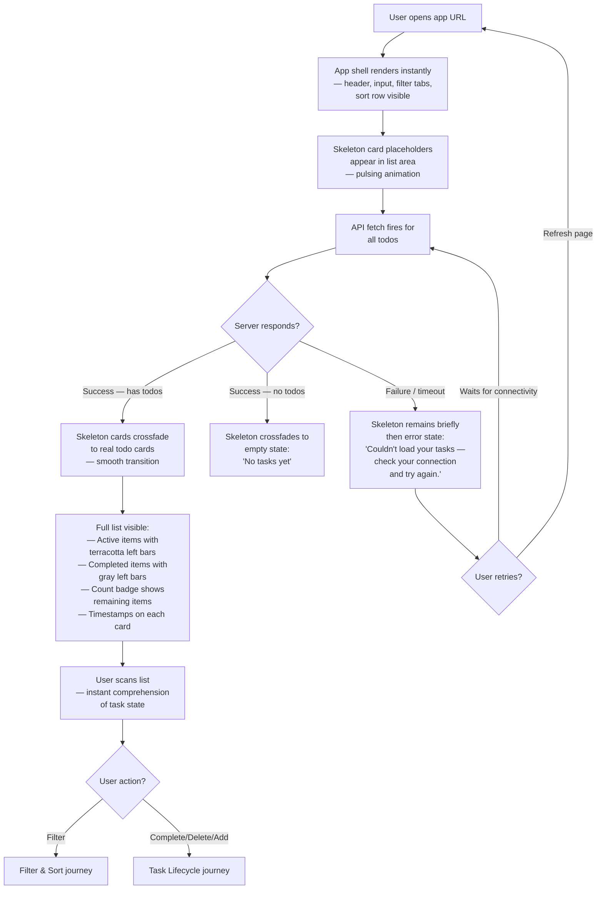

---
stepsCompleted:
  - 1
  - 2
  - 3
  - 4
  - 5
  - 6
  - 7
  - 8
  - 9
  - 10
  - 11
  - 12
  - 13
  - 14
lastStep: 14
completedAt: 2026-04-03
inputDocuments:
  - _bmad-output/planning-artifacts/product-brief-bmad-todo-app.md
  - _bmad-output/planning-artifacts/prd.md
---

# UX Design Specification bmad-todo-app

**Author:** Fab
**Date:** 2026-04-03

---

## Executive Summary

### Project Vision

bmad-todo-app is a browser-based personal todo application built on the principle that deliberate simplicity is a product strategy, not a limitation. The UX goal is immediate usability: a user opens the app and within seconds is creating, completing, and managing tasks — no accounts, no onboarding, no configuration. Every interaction should feel fast, obvious, and reliable. The design must convey "finished product at a small scope" rather than "prototype with missing features."

### Target Users

Individual users who need a personal task list and are frustrated by feature-heavy alternatives that demand setup, subscriptions, or learning curves before becoming useful. These users are moderately tech-savvy, work across desktop and mobile devices, and value speed and clarity above feature count. They have existing muscle memory from tools like Todoist, Apple Reminders, and Google Tasks — the UX should leverage familiar patterns (checkbox toggles, Enter-to-submit, strikethrough for completed) rather than invent new ones.

### Key Design Challenges

1. **Synchronous data flow perception** — The UI waits for server confirmation before reflecting changes. Loading feedback must appear within 100ms of user action so the experience feels responsive despite the round-trip wait. The design must avoid both "laggy" and "jittery" extremes.

2. **Active vs. completed visual balance** — Completed todos must be instantly distinguishable at a glance, yet remain interactive enough that users can discover and use the uncomplete toggle. The visual treatment must work across light contrast requirements (WCAG 2.1 AA) and on small mobile screens.

3. **Error resilience without context loss** — Network and server failures must surface clear, action-specific error messages while preserving the visible todo list and user state. The error UX must feel calm and recoverable, not alarming.

### Design Opportunities

1. **Empty state as first impression** — The zero-content state is the first experience for every new user. A thoughtfully designed empty state can instantly communicate purpose, invite action, and set the tone for the product.

2. **Microinteraction polish** — With a minimal feature set, each interaction can receive disproportionate attention: completion animations, smooth transitions on delete, satisfying input feedback. These small details differentiate a polished product from a basic CRUD interface.

3. **Keyboard-first efficiency** — Full keyboard navigability (an accessibility requirement) doubles as a power-user feature. Tab-and-Enter workflows for rapid task entry and management can make this app faster to use than mouse-dependent alternatives.

## Core User Experience

### Defining Experience

The core experience of bmad-todo-app is defined by two equally important interaction loops:

1. **The Capture Loop** — Type a task description, press Enter, see it appear in the list. This loop must feel instantaneous and frictionless, encouraging users to capture tasks the moment they think of them. The input field is always visible, always ready, and always the fastest path to action.

2. **The Review Loop** — Open the app, scan the list, filter to what matters, check things off. This loop must support rapid comprehension: the user should know their task status at a glance, filter with a single click, and complete items without leaving the list context.

Both loops are primary. The UX must serve rapid-fire task entry and calm task review without either feeling compromised.

### Platform Strategy

- **Platform:** Responsive web application — single codebase serving 320px mobile through desktop widths.
- **Input modes:** Keyboard-primary on desktop (Enter-to-submit, Tab navigation, keyboard shortcuts); touch-primary on mobile (appropriately sized tap targets, swipe-friendly layout).
- **No native apps, no PWA, no offline** in V1. The experience is a browser tab that loads fast and remembers everything.
- **Browser support:** Latest two versions of Chrome, Firefox, Safari, and Edge. No legacy browser support.

### Effortless Interactions

"Effortless" is defined as **minimum clicks/taps to complete any action**. Every interaction is measured against this principle:

| Action | Target Interaction Cost |
|---|---|
| Create a todo | Type + Enter (no extra buttons) |
| Complete a todo | Single click/tap on checkbox |
| Uncomplete a todo | Single click/tap on checkbox |
| Delete a todo | Single click/tap on delete control |
| Filter by status | Single click/tap per filter option |
| Sort todos | Single click/tap per sort option |

No action in the core set should require a modal, a confirmation dialog, or a multi-step sequence. If the user wants to do something, one deliberate interaction should be sufficient.

### Critical Success Moments

1. **First todo created (< 5 seconds from page load)** — The user arrives, sees the input field, types, and presses Enter. The todo appears in the list. No instructions were read, no buttons were hunted. This moment defines whether the product delivers on its zero-onboarding promise.

2. **Morning scan (instant comprehension)** — The returning user opens the app and immediately reads their task state: what's active, what's done, how many remain. Filtering to "active only" is one click away. The list is self-explanatory.

3. **Completion satisfaction (visual reward)** — Checking off a todo produces a clear, satisfying visual transition. The item shifts to a completed state without leaving the viewport or disrupting the list. The user stays in flow.

4. **Error without panic (trust preserved)** — A network failure surfaces a specific, calm error message. The existing list remains fully visible and intact. The user can retry or continue working. No data is lost, no context is broken.

### Experience Principles

1. **Minimum-Click Doctrine** — Every core action achievable in the fewest possible interactions. If an extra click exists, it must justify itself. This principle applies to both desktop clicks and mobile taps.

2. **Dual-Loop Fluency** — The capture loop (rapid task entry) and the review loop (scan, filter, complete) are equally important and equally polished. Neither is a secondary experience.

3. **Instant Legibility** — List state is readable at a glance without interaction. Active vs. completed distinction, remaining count, and current filter are all visible simultaneously.

4. **Familiar by Default** — Checkbox toggles, strikethrough for completed, Enter-to-submit, visible delete controls. Users carry over muscle memory from existing tools rather than learning new patterns.

5. **Graceful Under Pressure** — Empty, loading, and error states receive the same design attention as the happy path. Every state the user can encounter is intentionally designed.

## Desired Emotional Response

### Primary Emotional Goals

The emotional signature of bmad-todo-app is a blend of three complementary states:

1. **Calm Confidence** (foundation) — The user always feels in control. The interface is predictable, the data is safe, and every action has a clear outcome. Nothing is hidden, nothing is ambiguous. The user never has to wonder "did that work?"

2. **Productive Momentum** (rhythm) — The app supports flow. Actions are fast, transitions are smooth, and the user moves from task to task without friction. The experience encourages doing rather than deciding.

3. **Quiet Delight** (finish) — Small moments of visual pleasure and polish reward the user without demanding attention. A satisfying completion animation, a beautifully typeset list, a well-crafted empty state. The app is not just functional — it is visually beautiful and appealing.

The product must feel as good to look at as it does to use. Visual beauty is not decorative — it is part of the emotional contract with the user.

### Emotional Journey Mapping

| Stage | Target Emotion | What Triggers It |
|---|---|---|
| First visit | Clarity + Appeal | Clean, beautiful layout; obvious input field; inviting empty state |
| First todo created | Efficiency + Delight | Instant response; smooth animation; the list comes alive |
| Scanning the list | Control + Confidence | Clear status distinction; readable typography; calm visual hierarchy |
| Completing a todo | Satisfaction + Momentum | Rewarding visual transition; staying in flow; on to the next |
| Deleting a todo | Trust + Safety | Undo toast preserves confidence; no interruption; reversible |
| Returning next day | Trust + Comfort | Data intact; familiar layout; immediate readiness |
| Error occurs | Calm + Reassurance | Clear message; list preserved; no data lost; recoverable |

### Micro-Emotions

**Prioritized emotional states:**

- **Confidence over Confusion** — Every element communicates its purpose. Interactive elements look interactive. State changes are visible and immediate.
- **Trust over Skepticism** — Data persistence is reliable. The undo toast on delete removes fear of accidental loss. Server confirmation before UI update means what you see is what's saved.
- **Accomplishment over Frustration** — Completing a todo feels rewarding. The visual transition from active to completed provides a small sense of progress. Clearing a list feels like an achievement.
- **Delight over mere Satisfaction** — The app exceeds expectations for its scope. Visual beauty, smooth animations, and typographic care make a simple tool feel premium.

### Design Implications

| Emotional Goal | UX Design Approach |
|---|---|
| Calm Confidence | Consistent layout; predictable interactions; visible system state; no surprises |
| Productive Momentum | Fast transitions; input field always ready; no modals interrupting flow; one-click actions |
| Quiet Delight | Polished animations; beautiful typography; considered color palette; thoughtful empty state |
| Visual Beauty | Intentional whitespace; harmonious proportions; refined color system; attention to detail in every pixel |
| Trust (delete safety) | Undo toast after delete — immediate action with a brief reversal window, no confirmation dialog |
| Error Calm | Non-disruptive error banners; specific action-failure messaging; existing content always visible |

**Interactions to avoid (emotional anti-patterns):**
- Confirmation dialogs that interrupt flow and create decision fatigue
- Jarring error modals that obscure the list
- Aggressive or urgent visual language (red alerts, exclamation marks) for recoverable situations
- Bland or utilitarian aesthetics that signal "prototype" instead of "product"

### Emotional Design Principles

1. **Beauty Is Functional** — Visual appeal is not decoration. A beautiful interface communicates care, builds trust, and makes the product feel worth returning to. Every visual choice — color, spacing, typography, animation — serves both aesthetics and usability.

2. **Reward, Don't Interrupt** — Delight comes from smooth execution, not from attention-seeking UI. Animations celebrate actions without slowing them down. The undo toast informs without blocking.

3. **Protect the Flow State** — Nothing in the interface should force the user to stop and think about the interface. Decisions happen about tasks, not about the tool. Modals, confirmations, and multi-step sequences are avoided.

4. **Errors Are Conversations, Not Alarms** — When something goes wrong, the tone is calm and specific. "Couldn't save that todo — try again" not "ERROR: Network request failed." The user's context is preserved; the path to recovery is obvious.

5. **Trust Through Transparency** — The user always knows the state of their data. Synchronous updates mean the UI reflects reality. The undo toast means delete is reversible. Loading indicators mean the system is working. Nothing happens silently.

## UX Pattern Analysis & Inspiration

### Inspiring Products Analysis

Three products inform the UX direction for bmad-todo-app, chosen for their mastery of smooth transitions and the principle that a user should never feel "stuck":

**Satispay** (fintech / payments)
- Fluid, gesture-driven interactions where every action flows into the next with polished transitions. Nothing snaps, nothing jumps — the app feels alive.
- Visual feedback on actions is immediate and satisfying: color shifts, subtle animations, and confirmation states that reward interaction.
- Even simple operations (sending money, checking balance) feel premium because the motion design is exceptional.
- **Key lesson:** Transition quality elevates perceived product quality. The same action feels different depending on how it animates.

**Apple Reminders** (task management)
- Native simplicity with zero learning curve. Lists are just lists. The input is always accessible. Familiar platform patterns eliminate onboarding entirely.
- Content-first layout: minimal chrome, generous whitespace, and the list itself is the hero of the screen.
- The checkbox interaction is the gold standard for task completion — satisfying, clear, and instant.
- Recent redesigns added visual polish (color coding, smart grouping) without adding complexity — proof that beauty and simplicity coexist.
- **Key lesson:** Let the content breathe. The less the interface draws attention to itself, the more the user focuses on their tasks.

**Revolut** (fintech / banking)
- Information density without overwhelm. Shows substantial data (balances, transactions, analytics) using clear hierarchy, whitespace, and motion so nothing feels cluttered.
- Every flow is designed end-to-end with a clear next action. The user is never left wondering what to do. Navigation is predictable, transitions guide attention, and context is always preserved.
- Error states and edge cases handled inline — no modals, no dead ends, no context loss.
- **Key lesson:** "Never stuck" is a design principle, not an accident. Every screen state (empty, loading, error, success) must guide the user to their next action.

### Transferable UX Patterns

**Transition & Motion Patterns:**
- Smooth, physics-based transitions between states (inspired by Satispay) — elements slide, fade, and scale rather than appearing/disappearing instantly
- Completion animation on checkbox toggle that feels rewarding without slowing the user down
- List items animate in and out (add/delete) rather than popping or vanishing

**Layout & Content Patterns:**
- Content-first hierarchy (inspired by Apple Reminders) — the todo list is the hero; controls are secondary and unobtrusive
- Generous whitespace that lets items breathe, especially on mobile where touch targets need room
- Input field as a persistent, always-visible element — not hidden behind a button or floating action

**Flow & Navigation Patterns:**
- "Never stuck" principle (inspired by Revolut) — every state has a clear next action or path forward
- Inline error handling that preserves context rather than modal disruptions
- Filter controls visible and accessible without navigation — the user stays on one screen for all core actions
- Undo toast for delete (consistent with Revolut's inline recovery pattern)

**Visual Polish Patterns:**
- Considered color palette that communicates state (active, completed, error) without relying solely on text
- Typography hierarchy that makes scanning fast — task text is the most prominent element
- Subtle use of shadow, border, or background to distinguish interactive areas without heavy visual weight

### Anti-Patterns to Avoid

- **Snap transitions** — Elements that appear/disappear without animation break the feeling of a cohesive, living interface. Every state change should have a transition.
- **Dead-end states** — Any screen or state that leaves the user without a clear next action (e.g., empty list with no prompt, error with no recovery path). Inspired by Revolut's principle that every state guides forward.
- **Overbuilt controls** — Dropdowns, multi-level menus, or settings panels for a simple CRUD app. Apple Reminders succeeds by keeping controls flat and immediate.
- **Decorative animation** — Animation that exists for its own sake and slows the user down. Satispay's transitions are fast (200-300ms) — they enhance perception without adding wait time.
- **Utilitarian aesthetics** — A plain, unstyled, or "bootstrap default" look signals "prototype." The visual quality of Satispay and Revolut proves that polish is expected, even for simple tools.

### Design Inspiration Strategy

**Adopt:**
- Smooth, physics-based transitions on all state changes (Satispay's motion quality)
- Content-first, minimal-chrome layout with persistent input field (Apple Reminders' simplicity)
- "Never stuck" flow design — every state guides the user forward (Revolut's end-to-end flow thinking)
- Inline error handling and undo toast for recovery (Revolut's context-preservation pattern)

**Adapt:**
- Revolut's information hierarchy adapted for a single-entity list (todos) instead of multi-entity dashboard — simpler structure, same clarity principles
- Satispay's confirmation animations scaled to checkbox toggles and list operations — lighter, faster, but equally satisfying
- Apple Reminders' content-first approach combined with filter/sort controls that remain visible without competing with the list

**Avoid:**
- Snap/instant state changes with no transition
- Modal-based error handling or confirmation dialogs
- Hidden or buried controls (floating action buttons, hamburger menus)
- Decorative complexity that doesn't serve the dual-loop experience
- Generic or unstyled visual treatment that undermines the "quiet delight" emotional goal

## Design System Foundation

### Design System Choice

**Shadcn/ui + Tailwind CSS** — a themeable, accessible component library built on Radix UI primitives with Tailwind CSS for styling.

Components are copied into the codebase (not installed as a dependency), giving full ownership and customization freedom. Tailwind provides utility-first styling for pixel-perfect visual control. Radix UI primitives provide accessible keyboard navigation, focus management, and ARIA attributes out of the box.

### Rationale for Selection

| Factor | How Shadcn/ui + Tailwind Addresses It |
|---|---|
| Visual beauty | Tailwind provides complete control over color, spacing, typography, and animation — no fighting a pre-built theme |
| Accessibility (WCAG 2.1 AA) | Radix UI primitives handle keyboard navigation, focus management, and ARIA attributes by default |
| Bundle size (<200KB gzipped) | Tailwind purges unused CSS; Shadcn components are tree-shakeable since they live in your codebase |
| Smooth transitions | Full control over animation via Tailwind transitions/animations or CSS — no framework constraints |
| Solo developer speed | Pre-built, accessible component patterns to customize rather than building from scratch |
| Content-first layout | Tailwind's utility approach makes whitespace, typography hierarchy, and responsive layout straightforward |
| Long-term maintainability | Components are owned code, not a versioned dependency — no breaking updates, no migration burden |

### Implementation Approach

**Component strategy:** Copy only the components needed for V1. The required set is small:

- **Input** — Todo creation field (persistent, always visible)
- **Checkbox** — Completion toggle with custom styling
- **Button** — Delete control, filter/sort actions
- **Toast** — Undo delete notifications
- **Badge / Tabs** — Filter controls (All / Active / Completed)
- **Skeleton** — Loading state placeholders

Custom components built on Tailwind (no Shadcn equivalent needed):
- **Todo list item** — The core list row combining checkbox, text, and delete
- **Empty state** — First-visit illustration/prompt
- **Error banner** — Inline error messaging

**Theming approach:** Define a custom theme via Tailwind configuration and CSS variables — colors, typography scale, spacing rhythm, border radius, and shadow tokens. All components reference these tokens for visual consistency.

**Animation approach:** Use Tailwind's built-in transition utilities for simple state changes (hover, focus, color shifts). Use CSS transitions or a lightweight animation utility (e.g., Tailwind's `animate-` classes or custom keyframes) for list add/remove animations and completion transitions. Keep all animations under 300ms to maintain the Satispay-inspired "fast but fluid" standard.

### Customization Strategy

- **Override, don't extend:** Modify Shadcn component internals to match the exact visual language rather than layering overrides on top. Since components are owned code, direct editing is cleaner.
- **Design tokens first:** Establish color palette, type scale, spacing scale, and motion tokens before building components. Every component references tokens, never raw values.
- **Mobile-first responsive:** Use Tailwind's responsive breakpoints (sm, md, lg) to adapt layout from 320px upward. Touch targets sized at 44px minimum on mobile.
- **Accessibility preserved:** When customizing Shadcn components, preserve all Radix accessibility primitives (keyboard handlers, ARIA attributes, focus trapping). Visual customization only — never remove behavioral accessibility.

## Detailed Core User Experience

### Defining Experience

**"Open it and you're already working."**

The defining experience of bmad-todo-app is the absence of friction between intent and action. There is no gap between "I need to remember this" and the task being captured. There is no gap between "what do I need to do?" and the answer being visible. The product's value is felt in the first seconds of every session — not through a single signature gesture, but through the total elimination of obstacles between the user and their tasks.

This is the interaction a user describes to a friend: "You open it and you're already working. No setup, no clicking around, no figuring things out. Your list is right there."

### User Mental Model

Users approach bmad-todo-app with a **checklist mental model** — not a scratchpad for random notes, but a structured tool for tracking status and progress.

**What this means for design:**
- Items have clear binary states: done or not done. The checkbox is the natural interaction metaphor.
- Progress is implicit: as items move from active to completed, the user sees momentum. A count of remaining items reinforces this.
- The list has a lifecycle: items are created, tracked, completed, and eventually removed. Each phase should feel intentional.
- Order matters: users expect to scan the list and quickly assess what's left. Filtering (all/active/completed) and sorting (date/status) serve the checklist mental model directly.

**What users bring from existing tools:**
- Checkbox = toggle completion (Apple Reminders, Google Tasks, paper checklists)
- Strikethrough or visual dimming = "this is done" (universal convention)
- Enter = submit (web forms, messaging apps)
- The list is the whole product — no sidebar navigation, no secondary views, no settings to configure

**Where confusion could occur:**
- If completed items disappear entirely (users expect them to remain visible but visually receded)
- If the delete action isn't clearly distinct from completion (delete = permanent removal, complete = status change)
- If filter state isn't visible (user sees partial list without understanding why)

### Success Criteria

The core experience succeeds when:

1. **"This just works"** — The user creates their first todo without reading anything. The input field is obvious, Enter submits, the item appears. No hesitation.
2. **"I know where I stand"** — At a glance, the user can tell how many tasks are active, which are completed, and what needs attention. The checklist communicates progress without requiring interaction.
3. **"It's fast"** — Every action feels immediate. Even with synchronous server confirmation, loading feedback appears within 100ms so the user never perceives a wait.
4. **"It remembers everything"** — Returning users find their list exactly as they left it. Trust is built through consistent persistence.
5. **"I can't break it"** — Empty submissions are prevented, network errors are handled calmly, accidental deletes are reversible via undo toast. The user feels safe to act quickly.

### Novel UX Patterns

bmad-todo-app uses **exclusively established patterns** — there is no novel interaction design that requires user education.

**Established patterns adopted as-is:**
- Checkbox toggle for completion (universal checklist convention)
- Enter-to-submit for task creation (web form convention)
- Strikethrough/dimmed styling for completed items (universal)
- Filter tabs for list segmentation (All / Active / Completed)
- Undo toast for reversible delete (Google, Revolut pattern)

**Innovation within familiar patterns:**
- **Transition quality as differentiator** — Every established pattern is executed with Satispay-level motion polish. The checkbox doesn't just flip — it transitions smoothly. Items don't just appear — they animate into position. The innovation isn't in *what* the user does but in *how it feels* to do it.
- **"Never stuck" flow completeness** — Every state (empty, loading, error, filtered-to-zero) has a designed response with a clear next action. This is uncommon thoroughness for a simple todo app and elevates perceived quality.

### Experience Mechanics

#### The Capture Flow (Creating a Todo)

**1. Initiation:**
- The input field is always visible at the top of the interface — persistent, prominent, and clearly a form field
- Placeholder text communicates purpose (e.g., "Add a new task...")
- On desktop, the field may auto-focus on page load so the user can type immediately
- On mobile, the field is visually prominent and tappable with a large touch target

**2. Interaction:**
- The user types a task description into the form field
- The input feels structured and deliberate — a clear field with defined boundaries, not a chat-style inline input
- Pressing Enter submits the task (primary submission method)
- Empty or whitespace-only submissions are silently prevented — the field does not submit, no error shown for empty Enter

**3. Feedback:**
- A brief loading state indicates the server is processing (subtle spinner or field state change, appearing within 100ms)
- On success: the new todo animates into the list (smooth slide-in from top or fade-in), the input field clears and is ready for the next entry
- On failure: the input field retains the typed text, an inline error message appears ("Couldn't add that task — try again"), and the user can retry with Enter

**4. Completion:**
- The new item is visible in the list with active styling
- The input field is empty and focused, inviting the next entry (supports rapid-fire capture)
- The item count updates to reflect the addition

#### The Review Flow (Scanning, Filtering, Completing)

**1. Initiation:**
- The user opens the app and sees their full list immediately (no loading gate — show skeleton placeholders during fetch)
- Active and completed items are visually distinct at a glance
- Filter controls (All / Active / Completed) and sort controls are visible without interaction
- A remaining-items count provides instant progress awareness

**2. Interaction:**
- **Filter:** Single click/tap on a filter tab to segment the list. The active filter is visually highlighted. Transitions between filter states are animated (items fade out/in, not snap).
- **Sort:** Single click/tap to change sort order. List reorders with smooth animation.
- **Complete:** Single click/tap on a checkbox. The item transitions to completed styling (strikethrough, dimmed opacity) with a smooth animation.
- **Uncomplete:** Single click/tap on the same checkbox reverses the transition.
- **Delete:** Single click/tap on the delete control. The item animates out of the list. An undo toast appears for a brief window (5-8 seconds).

**3. Feedback:**
- Checkbox toggles produce an immediate visual transition (within 100ms perceived) followed by server confirmation
- Filter changes animate the list smoothly — items that don't match the filter fade or slide out; matching items remain
- The remaining-items count updates in real time as items are completed or uncompleted
- The undo toast for delete includes a clear "Undo" action and auto-dismisses after the reversal window

**4. Completion:**
- After a review session, the user has a clear picture of their task state
- All changes are persisted — closing the tab and returning later shows the exact same state
- If all items are completed or deleted, an empty state appears that invites new task creation (closing the loop back to capture)

## Visual Design Foundation

### Color System

**Direction: Earthy Modern** — A warm, distinctive palette that stands apart from the blue/gray todo app crowd. The color system communicates calm confidence through natural tones while using a warm coral/terracotta accent for energy and memorability.

**Core Palette:**

| Token | Role | Value | Description |
|---|---|---|---|
| `--background` | Page background | Light warm stone (#F5F0EB) | Soft, warm base that avoids sterile white |
| `--surface` | Card/component background | Warm white (#FAFAF7) | Slightly lighter than background for layering |
| `--text-primary` | Headings, todo text | Rich dark brown-gray (#2C2825) | Warm, readable, softer than pure black |
| `--text-secondary` | Metadata, counts, placeholders | Medium warm gray (#8A8279) | Clear hierarchy without harshness |
| `--text-completed` | Completed todo text | Muted warm gray (#B5AFA8) | Visually receded but still legible |
| `--accent` | Primary actions, active filter, focus rings | Warm terracotta (#C4654A) | Distinctive, inviting, energetic |
| `--accent-hover` | Hover/pressed state for accent | Darker terracotta (#A8523B) | Clear interactive feedback |
| `--accent-subtle` | Light accent backgrounds | Soft terracotta tint (#F5E6E1) | For badges, active filter background |
| `--border` | Dividers, input borders | Warm light gray (#DDD6CE) | Subtle structure without visual noise |
| `--border-focus` | Focused input/element border | Terracotta (#C4654A) | Matches accent for consistency |
| `--success` | Completion feedback | Warm sage green (#6B8F71) | Natural, calming confirmation |
| `--error` | Error messages, failed states | Muted warm red (#C45A4A) | Noticeable but not alarming — "conversation, not alarm" |
| `--error-bg` | Error banner background | Soft red tint (#F5E1DF) | Calm error surface |
| `--toast-bg` | Undo toast background | Dark warm gray (#3D3835) | High contrast for visibility, warm tone |
| `--toast-text` | Undo toast text | Warm white (#FAFAF7) | Readable against dark toast |

**Semantic Color Usage:**
- **Active todo items:** `--text-primary` on `--surface` — full visual weight, high readability
- **Completed todo items:** `--text-completed` with strikethrough on `--surface` — visually receded but still interactive
- **Input field:** `--text-primary` text, `--border` default border, `--border-focus` on focus with subtle `--accent-subtle` glow
- **Filter tabs:** `--text-secondary` default, `--accent` text + `--accent-subtle` background when active
- **Delete control:** `--text-secondary` default, `--error` on hover — escalating visual weight signals destructive action
- **Error states:** `--error` text on `--error-bg` background — warm, not alarming

**Contrast Compliance (WCAG 2.1 AA):**
- `--text-primary` on `--surface`: ~14:1 (exceeds AA requirement of 4.5:1)
- `--text-secondary` on `--surface`: ~4.6:1 (meets AA for normal text)
- `--text-completed` on `--surface`: ~3.2:1 (meets AA for large text; completed items use strikethrough as a secondary indicator beyond color alone)
- `--accent` on `--surface`: ~4.7:1 (meets AA for normal text and interactive elements)
- `--toast-text` on `--toast-bg`: ~13:1 (exceeds AA)

### Typography System

**Approach: System Font Stack** — Zero load cost, native feel on every platform, and excellent rendering at all sizes. The system stack adapts to each operating system's native typeface, making the app feel at home on every device.

**Font Stack:**
```
font-family: -apple-system, BlinkMacSystemFont, "Segoe UI", Roboto, "Helvetica Neue", Arial, sans-serif;
```

This renders as:
- **macOS/iOS:** San Francisco — Apple's native typeface, optimized for screens
- **Windows:** Segoe UI — Microsoft's modern interface font
- **Android:** Roboto — Google's Material Design typeface
- **Fallback:** Helvetica Neue → Arial → generic sans-serif

**Type Scale (based on 16px root):**

| Token | Size | Weight | Line Height | Usage |
|---|---|---|---|---|
| `--text-xl` | 24px (1.5rem) | 600 (semibold) | 1.3 | App title / main heading |
| `--text-lg` | 18px (1.125rem) | 500 (medium) | 1.4 | Section headings (if needed) |
| `--text-base` | 16px (1rem) | 400 (regular) | 1.5 | Todo item text — the most important size |
| `--text-sm` | 14px (0.875rem) | 400 (regular) | 1.4 | Filter labels, sort controls, metadata |
| `--text-xs` | 12px (0.75rem) | 500 (medium) | 1.3 | Item count badge, timestamps |

**Typography Decisions:**
- Todo item text at 16px ensures readability on mobile without zooming (iOS auto-zooms inputs below 16px)
- Semibold for headings, regular for body — minimal weight variation keeps the interface calm
- Completed items: same size, reduced color (`--text-completed`), plus `text-decoration: line-through`
- Placeholder text: `--text-secondary` at `--text-base` — inviting but clearly inactive

### Spacing & Layout Foundation

**Base Unit: 8px** — All spacing values are multiples of 8px, creating a consistent visual rhythm.

**Spacing Scale:**

| Token | Value | Usage |
|---|---|---|
| `--space-1` | 4px | Tight internal padding (icon-to-text gap) |
| `--space-2` | 8px | Compact spacing (between related elements) |
| `--space-3` | 12px | Standard inner padding (within components) |
| `--space-4` | 16px | Component padding (input field, list items) |
| `--space-5` | 24px | Section spacing (between input and list) |
| `--space-6` | 32px | Major section separation |
| `--space-8` | 48px | Page-level padding (top/bottom margins) |

**Layout Strategy: Airy but Efficient**

The layout uses generous whitespace to create a premium, calm feeling while keeping enough content visible for practical task management.

- **Page container:** Centered, max-width 640px on desktop. The todo list doesn't need to stretch across wide screens — a contained width improves readability and focus.
- **Page padding:** `--space-8` (48px) top, `--space-6` (32px) sides on desktop; `--space-4` (16px) sides on mobile.
- **Input field:** Full-width within container, `--space-4` (16px) internal padding, `--space-5` (24px) margin below separating it from the list.
- **List items:** `--space-4` (16px) vertical padding per item, creating 44px+ touch targets. `--space-3` (12px) horizontal padding. Items separated by a subtle `--border` divider.
- **Filter/sort controls:** `--space-5` (24px) margin above the list, `--space-2` (8px) gap between filter tabs.
- **Empty state:** Centered vertically with `--space-8` (48px) padding, allowing the message to breathe.
- **Error banners:** `--space-3` (12px) padding, `--space-4` (16px) margin from the input field. Positioned between input and list so it doesn't push content off-screen.

**Responsive Behavior:**
- **320px–639px (mobile):** Single column, reduced side padding (`--space-4`), full-width components, 44px minimum touch targets
- **640px+ (desktop):** Centered container at max-width 640px, increased side padding (`--space-6`), hover states enabled

### Accessibility Considerations

**Color Independence:**
- Status is never communicated by color alone. Completed items use strikethrough text decoration + reduced opacity + color change — three independent signals.
- Error states combine color change + icon + text message.
- Active filter uses background highlight + text color + text weight.

**Focus Indicators:**
- All interactive elements display a visible focus ring (`--accent` color, 2px offset) when navigated via keyboard.
- Focus rings use `outline` (not `border`) to avoid layout shifts.
- Focus ring color (`--accent` terracotta) meets contrast requirements against `--surface` and `--background`.

**Motion Sensitivity:**
- All animations respect `prefers-reduced-motion` media query — when enabled, transitions are replaced with instant state changes.
- No animation is required to understand the interface — all information is conveyed through static visual states.

**Touch Targets:**
- All interactive elements (checkboxes, delete buttons, filter tabs, input field) have minimum 44x44px touch target area.
- Where visual size is smaller (e.g., checkbox icon), the tappable area extends via padding to meet the minimum.

## Design Direction Decision

### Design Directions Explored

Six design directions were generated and evaluated using the Earthy Modern palette, system font stack, and 8px spacing system:

1. **Classic Card** — Top input, pill filters, clean dividers, visible delete buttons
2. **Floating Input** — Bottom-positioned input, centered header, round checkboxes
3. **Minimal Flat** — Underline input, no card wrapper, uppercase labels, maximum content focus
4. **Bold Accent** — Terracotta header bar, row cards with elevation, full-width tab filters with underline
5. **Soft Elevated** — Borderless input with soft shadow, rounded cards per item, generous radius, warmest feel
6. **Dense Productive** — Compact rows, inline timestamps, sort control, count badge, efficiency-first

Interactive HTML mockups generated at `ux-design-directions.html` for comparison.

### Chosen Direction

**Hybrid: Soft Elevated base + Bold Accent tab filters + Dense Productive metadata**

The final direction combines elements from three explorations into a cohesive design:

**From Direction 5 (Soft Elevated) — the foundation:**
- Borderless input field with soft shadow and terracotta focus ring glow
- Rounded cards (12px radius) per todo item with subtle border and elevation
- Warm stone page background (`--bg`) with layered surface cards (`--active-bg`, `--completed-bg`)
- Centered header with accent-colored count badge
- Overall warm, airy, premium aesthetic

**From Direction 4 (Bold Accent) — the filter tabs:**
- Full-width segmented filter tabs spanning the container
- Equal-width filter options (All / Active / Completed)
- Active state indicated by terracotta text + underline (2px bottom border)

**From Direction 6 (Dense Productive) — structure and metadata:**
- Dedicated sort row below filters with subtle background strip
- Sort options: **Date ↓** and **Status ↕** (toggle between active-first and completed-first)
- Status sort hidden when filter is Active or Completed (redundant when already filtered)
- Inline timestamp metadata on each todo item (e.g., "Today", "Yesterday", "Apr 1")
- Count badge in header (accent-colored pill showing remaining items)

**Additional refinements from iteration:**
- **Add button** beside the input field — terracotta "+" button matching input height, providing a clear tap target on mobile. Enter key remains the primary desktop shortcut.
- **Smooth active/completed card distinction:**
  - Active cards: warm white background (`--active-bg: #FBF9F7`) + soft muted terracotta left bar (`--active-bar: #D9A193`)
  - Completed cards: muted stone background (`--completed-bg: #F3EFEA`) + soft gray left bar (`--completed-bar: #D4CEC7`) + strikethrough + dimmed text
  - Both states have a left bar for visual rhythm; the distinction is smooth and gentle rather than sharp on/off
- **Subtle card borders** — every task card has a light border (`--border`) for added definition and separation

Final interactive mockup generated at `ux-design-direction-final.html` showing desktop, mobile, filter states, UI states, and hover/focus interactions.

### Design Rationale

| Decision | Rationale |
|---|---|
| Soft Elevated base | Delivers the "quiet delight" and "visual beauty" emotional goals. The warmth and rounded cards create a premium feel that distinguishes from utilitarian todo apps. |
| D4 tab filters (full-width underline) | Clear, structured filter navigation that supports the review loop. Full-width tabs give equal weight to each filter option. Underline indicator is clean and familiar. |
| Separate sort row | Keeps filter tabs visually clean and undistracted. Sort is secondary to filtering — the visual hierarchy reflects this. Status sort hides contextually to avoid redundancy. |
| Single Status ↕ toggle | Minimum-click doctrine — one button toggles direction rather than choosing between two. The ↕ arrow communicates "toggleable." |
| Add button beside input | Supports both input modes: Enter for keyboard users, tap "+" for mobile/touch users. Reinforces the form-field mental model. Does not replace Enter — it supplements it. |
| Smooth card distinction | Both active and completed cards belong to the same visual family (both have left bars, both have borders). The difference is gentle — warm vs. muted — supporting "instant legibility" without harsh visual breaks. |
| Card borders | Adds definition to each item without heavy visual weight. Works with the soft elevated aesthetic rather than against it. |
| Inline timestamps | Supports the review loop — users can see when tasks were created without extra interaction. Small, secondary text that doesn't compete with task descriptions. |

### Implementation Approach

The chosen direction maps directly to the Shadcn/ui + Tailwind implementation:

**Component mapping:**
- Input field + Add button → Shadcn `Input` + custom `Button`, wrapped in a flex container
- Filter tabs → Custom tab component using Tailwind, full-width flex with border-bottom indicator
- Sort row → Custom flex row with toggle buttons
- Todo card → Custom component: flex row with left border, checkbox, text, meta, delete button
- Undo toast → Shadcn `Toast` with dark warm background
- Skeleton loading → Shadcn `Skeleton` shaped as cards
- Empty state → Custom centered component
- Error banner → Custom inline banner component

**CSS variable tokens to implement:**
All color tokens defined in the Visual Design Foundation section, plus the new card-specific tokens:
- `--active-bg: #FBF9F7` (active card background)
- `--active-bar: #D9A193` (active card left bar)
- `--completed-bg: #F3EFEA` (completed card background)
- `--completed-bar: #D4CEC7` (completed card left bar)

**Animation targets:**
- Card appear/disappear: slide + fade (200-300ms)
- Checkbox toggle: smooth color/fill transition (200ms)
- Filter tab switch: list items fade out/in (250ms)
- Delete → undo toast: card slides out, toast slides up (200ms)
- All animations respect `prefers-reduced-motion`

## User Journey Flows

### Journey 1: First Visit → First Todo

The user arrives at bmad-todo-app for the first time. No account, no onboarding — straight to task creation.

**Entry point:** User opens the app URL in a browser.

**Flow:**



**Key UX moments:**
- Empty state is the first impression — inviting, clear, purposeful
- Input auto-focus on desktop means the user can type immediately
- Failed submission preserves typed text — no re-entry required
- First card animation makes the list "come alive"
- Input clears and refocuses for rapid-fire capture

### Journey 2: Task Lifecycle (Create → Complete → Uncomplete → Delete → Undo)

The full CRUD lifecycle of a single todo item through all states.

**Entry point:** User has an existing list of tasks.

**Flow:**



**Key UX decisions:**
- Delete uses optimistic removal + deferred API call (during undo window), unlike other actions which are synchronous. This is the one exception to the synchronous data flow rule — justified because the undo toast provides a reversal mechanism.
- Complete/uncomplete transitions are smooth and multi-property (background, bar color, text styling, checkbox fill) — creating the Satispay-inspired "alive" feeling.
- Error recovery always preserves the previous state — no data is lost on failure.

### Journey 3: Filter & Sort

The user manages their list view to focus on what matters.

**Entry point:** User has a mixed list (active + completed items), "All" filter active.

**Flow:**



**Key UX decisions:**
- Filter transitions are animated — items don't snap, they fade/slide out and in
- Status sort disappears when a filter is active (redundant)
- Filtered empty states are specific — they explain *why* the list is empty and guide the next action
- Sort reordering uses smooth list animation, not a page refresh
- Tab underline animates between positions for visual continuity

### Journey 4: Error Recovery

The user encounters failures on mobile with spotty connectivity.

**Entry point:** User is on mobile, network is unreliable.

**Flow:**



**Key UX principles in error states:**
- **List always visible** — errors never obscure existing content
- **Error banners are positioned between input and list** — visible without pushing content off-screen
- **Action-specific messages** — "Couldn't add that task" not "Network error"
- **Input preserves text on failure** — no re-typing required
- **Checkbox reverts on failure** — state is honest, never shows uncommitted changes
- **Delete undo window protects against network failures** — if undo wasn't tapped but delete API fails, the item reappears
- **Error banners auto-dismiss** — after 8 seconds or after the next successful action, whichever comes first

### Journey 5: Return Visit

The user opens the app on a subsequent visit. Data is persisted; the list loads from the server.

**Entry point:** User opens the app URL (not first visit — has existing todos).

**Flow:**



**Key UX decisions:**
- **App shell renders instantly** — header, input, filters, sort row are all static and appear before data loads. The user sees a complete-looking interface immediately.
- **Skeleton cards match real card shape** — rounded cards with checkbox placeholder, matching the soft elevated aesthetic. The loading state feels designed, not broken.
- **Crossfade transition** — skeletons don't snap to real cards; they smoothly crossfade for visual continuity.
- **Return visit feels instant** — if API responds quickly (<200ms), the user barely notices the skeleton state. The experience matches the "open it and you're already working" defining experience.

### Journey Patterns

Reusable patterns extracted across all five journeys:

**Feedback Pattern: Loading → Success/Failure**
Every server-dependent action follows the same pattern:
1. Immediate visual feedback (within 100ms) — loading indicator, pending state, or skeleton
2. Wait for server confirmation
3. On success: smooth transition to new state
4. On failure: revert to previous state + action-specific error banner

**Recovery Pattern: Preserve and Inform**
Every error state follows the same rules:
1. Existing content remains visible and intact
2. Error message identifies the specific failed action
3. The path to retry is obvious (same interaction that triggered the error)
4. Error banners auto-dismiss after 8 seconds or next successful action

**Delete Pattern: Optimistic Remove + Undo Window**
Delete is the one exception to synchronous data flow:
1. Card removes immediately (optimistic)
2. Undo toast provides a reversal window (5-8 seconds)
3. API call fires only after undo window expires
4. If API fails after undo expires, card reappears with error

**Empty State Pattern: Context-Specific Guidance**
Every empty state explains *why* the list is empty and what to do next:
- No todos at all → "No tasks yet" + prompt to create
- No active todos → "No active tasks" + prompt to add
- No completed todos → "No completed tasks" + explanation that completed items appear here
- Load failure → Error message + retry guidance

### Flow Optimization Principles

1. **Skeleton-first loading** — Show the app shell and skeleton cards immediately. Never show a blank screen or a centered spinner. The user should feel like the app is already "there" before data arrives.

2. **Deferred destructive actions** — Delete uses an undo window rather than a confirmation dialog. This supports the minimum-click doctrine while protecting against accidental loss.

3. **Error banners, not modals** — All errors are communicated inline between the input and list. No modals, no full-screen error pages, no alert dialogs. The user's context is always preserved.

4. **Input text preservation** — On create failure, the typed text is never lost. The user can retry with Enter/+ without re-typing. This is critical for mobile users on unreliable networks.

5. **Animated state transitions** — Every state change (filter, sort, complete, add, delete) uses smooth animation. This creates visual continuity and supports the "never stuck" principle — the user always sees where things came from and where they went.

## Component Strategy

### Design System Components

**Shadcn/ui components to copy and customize:**

| Component | Shadcn Source | Customization Needed |
|---|---|---|
| Checkbox | `@radix-ui/react-checkbox` | Custom styling: rounded-lg (8px), sage green fill, warm border colors, 24x24px size |
| Input | Shadcn `Input` | Remove border, add soft shadow, 14px radius, terracotta focus ring with glow |
| Button | Shadcn `Button` | Two variants: (1) Terracotta add button (50x50, 14px radius), (2) Ghost delete button (30x30, 8px radius) |
| Toast | Shadcn `Sonner` integration | Dark warm gray background, terracotta "Undo" link, 12px radius, auto-dismiss 5-8 seconds |
| Skeleton | Shadcn `Skeleton` | Card-shaped skeletons matching TodoCard dimensions, warm border color pulse animation |

**Rationale for Shadcn choices:** These components provide Radix accessibility primitives (keyboard navigation, ARIA attributes, focus management) that would be expensive to build from scratch. Visual customization is straightforward since components are owned code.

### Custom Components

#### TodoCard

**Purpose:** The core list item displaying a single todo with status, text, metadata, and actions.

**Anatomy:**
- Left accent bar (3px) — `--active-bar` or `--completed-bar` based on status
- Checkbox (Shadcn, customized) — toggle completion
- Task text — primary content, 16px, with strikethrough when completed
- Timestamp metadata — creation date, 11px, right-aligned
- Delete button — ghost "✕", revealed on hover (visible at 50% opacity on mobile)

**States:**

| State | Background | Left Bar | Text | Checkbox | Shadow |
|---|---|---|---|---|---|
| Active | `--active-bg` (#FBF9F7) | `--active-bar` (#D9A193) | `--text-primary` | Empty, warm border | Subtle elevation |
| Completed | `--completed-bg` (#F3EFEA) | `--completed-bar` (#D4CEC7) | `--text-completed` + strikethrough | Sage green fill + ✓ | None |
| Hovered (active) | `--active-bg` | `--active-bar` | `--text-primary` | Border → sage green | Increased elevation |
| Hovered (completed) | `--completed-bg` | `--completed-bar` | `--text-completed` | Sage green fill | Slight elevation |
| Loading (pending) | Current bg | Current bar | Current text | Pending indicator | Current shadow |
| Animating in | Fade + slide from top | — | — | — | — |
| Animating out (delete) | Fade + slide out | — | — | — | — |

**Accessibility:**
- `role="listitem"` within a `role="list"` container
- Checkbox: `aria-label="Mark [task text] as complete"` / `"Mark [task text] as active"`
- Delete button: `aria-label="Delete [task text]"`
- Focus order: checkbox → delete button (Tab navigation within item)
- After completion toggle: focus remains on the checkbox
- After delete: focus moves to next item's checkbox, or input field if list is empty

**Responsive:**
- Desktop: delete button hidden until hover
- Mobile: delete button visible at 50% opacity (no hover on touch)
- Minimum height: 44px (touch target compliance)
- Card padding: 14px 16px desktop, 12px 14px mobile

#### AddInput

**Purpose:** Composite component combining the text input field and add button for task creation.

**Anatomy:**
- Input field (Shadcn, customized) — full width, borderless, soft shadow
- Add button (Shadcn Button, customized) — 50x50 terracotta "+"

**States:**

| State | Input | Button |
|---|---|---|
| Default | Placeholder text "Add a new task...", subtle shadow | Terracotta bg, white "+" |
| Focused | Terracotta ring (2px) + glow shadow | Unchanged |
| Typing | User text, terracotta ring | Unchanged |
| Submitting | Text visible, subtle loading indicator | Slightly dimmed (disabled) |
| Error | Retains typed text, ring removed | Re-enabled |
| Success | Clears, refocuses, placeholder returns | Re-enabled |

**Accessibility:**
- Input: `aria-label="New task description"`, `placeholder="Add a new task..."`
- Button: `aria-label="Add task"`, `type="submit"`
- Wrapped in a `<form>` element so Enter triggers submit natively
- On submit success: `aria-live="polite"` region announces "Task added"

**Behavior:**
- Enter key and button click both trigger the same submit handler
- Empty/whitespace-only submissions silently prevented (no error, no submission)
- On API failure: input retains text, error banner appears separately
- On success: input clears, refocuses, ready for next entry

#### FilterTabs

**Purpose:** Full-width segmented tab bar for filtering the todo list by status.

**Anatomy:**
- Three equal-width tab buttons: "All", "Active", "Completed"
- Active indicator: 2px terracotta underline on the active tab
- Container has a bottom border separating it from the sort row

**States:**

| State | Text Color | Underline | Behavior |
|---|---|---|---|
| Inactive | `--text-secondary` | None | Clickable |
| Hover (inactive) | `--text-primary` | None | Visual feedback |
| Active | `--accent` (terracotta) | 2px `--accent` bottom border | Selected filter |

**Accessibility:**
- `role="tablist"` container
- Each tab: `role="tab"`, `aria-selected="true/false"`, `aria-controls="todo-list"`
- Keyboard: Left/Right arrow keys move between tabs, Enter/Space activates
- On filter change: `aria-live="polite"` region announces "[N] tasks shown"

**Behavior:**
- Single click/tap switches filter
- Underline animates between tab positions (CSS transition)
- Filter change triggers animated list transition (items fade out/in)
- Selecting Active or Completed hides the Status sort option in the sort row

#### SortRow

**Purpose:** Secondary control row for sorting the todo list.

**Anatomy:**
- "Sort by" label — uppercase, small, secondary text
- Sort options: "Date ↓" and "Status ↕" (when "All" filter is active)
- Vertical divider between options
- Subtle background strip to visually separate from filter tabs

**States:**

| State | Active Sort | Inactive Sort |
|---|---|---|
| Default | `--text-primary`, bold, surface bg | `--text-secondary`, regular weight |
| Hover (inactive) | — | `--text-primary`, surface bg |

**Conditional visibility:**
- Filter = "All": show both "Date ↓" and "Status ↕"
- Filter = "Active" or "Completed": show only "Date ↓" (status sort hidden)

**Behavior:**
- "Date ↓" sorts by creation date, newest first
- "Status ↕" toggles between active-first and completed-first on each click
- Sort change triggers animated list reordering
- Active sort button has highlighted styling

**Accessibility:**
- `role="toolbar"` container with `aria-label="Sort options"`
- Each sort button: `role="button"`, `aria-pressed="true/false"`
- Keyboard: Tab to enter toolbar, Left/Right between options, Enter/Space to activate

#### EmptyState

**Purpose:** Contextual message displayed when the todo list has no items to show.

**Anatomy:**
- Icon (emoji or simple glyph) — centered, reduced opacity
- Title message — 16px, primary text color
- Hint text — 14px, secondary text color, guides next action

**Variants:**

| Context | Icon | Title | Hint |
|---|---|---|---|
| No todos (first visit) | ☑ | "No tasks yet" | "Type above and press Enter (or tap +) to add your first task." |
| No active todos (filtered) | 🔍 | "No active tasks" | "Add a task above to get started." |
| No completed todos (filtered) | 🔍 | "No completed tasks" | "Tasks you complete will appear here." |
| Load failure | ⚠ | "Couldn't load your tasks" | "Check your connection and try again." |

**Accessibility:**
- Container: `role="status"`, `aria-live="polite"`
- Title and hint are readable by screen readers
- Centered layout with generous padding (`--space-8`)

#### ErrorBanner

**Purpose:** Inline notification for action-specific failures. Positioned between the input and the todo list.

**Anatomy:**
- Warning icon (⚠)
- Error message text — action-specific, conversational tone
- Container with `--error-bg` background and `--error` text, 10px radius

**Behavior:**
- Appears with a smooth slide-down animation
- Auto-dismisses after 8 seconds or after the next successful action
- Does not obscure the todo list — positioned above the list, below the input/filters
- Multiple errors replace (not stack) — only the most recent error is shown

**Messages:**

| Failed Action | Message |
|---|---|
| Create todo | "Couldn't add that task — check your connection and try again." |
| Complete/uncomplete | "Couldn't update that task — try again." |
| Delete (after undo expired) | "Couldn't delete that task — try again." |
| Load todos | "Couldn't load your tasks — check your connection and try again." |

**Accessibility:**
- `role="alert"` for immediate screen reader announcement
- `aria-live="assertive"` — errors are announced immediately, not queued

### Component Implementation Strategy

**Build order (aligned with user journey priority):**

1. **Phase 1 — Core (supports Journey 1: First Visit):**
   - AddInput (input + add button)
   - TodoCard (active state only)
   - EmptyState (no-todos variant)
   - Skeleton (loading cards)

2. **Phase 2 — Complete CRUD (supports Journey 2: Task Lifecycle):**
   - TodoCard (completed state, hover states, animations)
   - Checkbox (completion toggle with transitions)
   - Toast (undo delete)
   - ErrorBanner

3. **Phase 3 — Organization (supports Journey 3: Filter & Sort):**
   - FilterTabs
   - SortRow
   - EmptyState (filtered variants)
   - List animation (filter/sort transitions)

**Composition pattern:**
All custom components are composed from Tailwind utilities + design tokens. No component has internal state management — state is lifted to the page/container level and passed down as props. This keeps components pure, testable, and consistent with React best practices.

**Token consistency:**
Every component references CSS variable tokens (not raw values) for colors, spacing, typography, and border radius. This ensures a single source of truth and makes theme adjustments trivial.

## UX Consistency Patterns

### Button Hierarchy

Four button types with clear visual priority, ordered from most to least prominent:

| Priority | Button | Visual Treatment | Usage |
|---|---|---|---|
| 1 (Primary) | Add task (+) | Solid terracotta fill, white icon, 50x50, shadow | Task creation — the most important action |
| 2 (Interactive) | Filter tabs | Text-only, terracotta underline when active | View management — frequent but secondary |
| 3 (Utility) | Sort options | Small text, surface bg when active | List organization — occasional use |
| 4 (Destructive) | Delete (✕) | Ghost, hidden until hover/visible on mobile | Removal — intentionally de-emphasized |

**Rules:**
- Only one primary action exists on screen (the add button)
- Destructive actions never use primary styling — they escalate visually only on hover (ghost → red background)
- Filter and sort controls use text-only treatments to avoid competing with the primary action
- No disabled states for buttons in V1 — buttons are either visible and interactive or hidden

### Feedback Patterns

**Loading Feedback:**

| Action | Feedback | Timing | Location |
|---|---|---|---|
| Page load | Skeleton cards (pulsing) | Immediate | List area |
| Create todo | Subtle input spinner/state change | Within 100ms | Input field |
| Complete/Uncomplete | Checkbox pending state | Within 100ms | Checkbox element |
| Delete | Card animates out immediately | Instant | List item |

**Success Feedback:**

| Action | Feedback | Animation |
|---|---|---|
| Create | Card slides in, input clears + refocuses | 200-300ms slide + fade |
| Complete | Multi-property transition (bg, bar, text, checkbox) | 200ms ease |
| Uncomplete | Reverse of complete transition | 200ms ease |
| Delete | Card already removed; toast auto-dismisses on timeout | Toast: 5-8s then fade |
| Page load | Skeletons crossfade to real cards | 250ms crossfade |

**Error Feedback:**

| Action | Feedback | Duration | Behavior |
|---|---|---|---|
| Create failure | Error banner + input retains text | 8s or next success | Slide-down animation |
| Complete failure | Checkbox reverts + error banner | 8s or next success | Revert + slide-down |
| Delete failure (post-undo) | Card reappears + error banner | 8s or next success | Slide-in + slide-down |
| Page load failure | Error message in list area | Persistent until retry | Replace skeleton |

**Undo Feedback:**
- Dark toast, bottom-center, with "Undo" link in terracotta
- 5-8 second window, auto-dismisses
- Only one toast visible at a time (new delete replaces previous)

### Form Patterns

Only one form exists: the task creation input.

**Validation rules:**
- Empty or whitespace-only input: silently prevented (no submission, no error message)
- Valid text + Enter or + button: submit to API
- No character limit in V1 (server may enforce one)
- No real-time validation — validation happens only on submission attempt

**Submission behavior:**
- Two submit methods: Enter key (primary, keyboard), Add button (secondary, touch)
- Wrapped in a `<form>` element for native Enter behavior
- During API call: input is not disabled (user can edit text if the call fails)
- On success: clear input, refocus, ready for next entry
- On failure: retain input text, show error banner, user retries with same input

**Input focus behavior:**
- Desktop: auto-focus on page load (user can type immediately)
- Mobile: no auto-focus (avoids unwanted keyboard popup)
- After successful create: refocus input
- After failed create: keep focus on input
- Focus ring: 2px terracotta outline + subtle glow shadow

### Animation & Transition Patterns

**Timing tokens:**

| Token | Duration | Usage |
|---|---|---|
| `--duration-fast` | 150ms | Hover states, focus rings, button feedback |
| `--duration-normal` | 200ms | Checkbox transitions, card property changes |
| `--duration-smooth` | 250ms | List reorder, filter transitions, skeleton crossfade |
| `--duration-enter` | 300ms | Card appear (slide + fade in) |
| `--duration-exit` | 200ms | Card remove (slide + fade out) — exits are faster than enters |

**Easing:**
- Standard transitions: `ease-out` (fast start, gentle stop — feels responsive)
- Enter animations: `ease-out` (element settles into place)
- Exit animations: `ease-in` (element accelerates away)
- Spring-like feel (for card appear): `cubic-bezier(0.34, 1.56, 0.64, 1)` — slight overshoot for liveliness

**Animation rules:**
- Every state change has a transition — nothing snaps instantly
- Animations are fast enough to not feel like waiting (max 300ms)
- Exit animations are faster than enter animations (200ms vs 300ms)
- All animations respect `prefers-reduced-motion` — when enabled, transitions are replaced with instant state changes (0ms duration)
- No animation is required to understand the UI — all meaning is conveyed through static visual states
- List reorders animate items to new positions rather than fading out and in

**Specific animation specs:**

| Animation | Type | Duration | Easing | Description |
|---|---|---|---|---|
| Card enter | Slide + fade | 300ms | ease-out | Slides down from above with opacity 0→1 |
| Card exit (delete) | Slide + fade | 200ms | ease-in | Slides right and fades out |
| Card exit (filter) | Fade | 250ms | ease-out | Opacity 1→0, height collapses |
| Checkbox toggle | Fill + color | 200ms | ease-out | Background and border color transition |
| Complete transition | Multi-property | 200ms | ease-out | Background, bar color, text color, strikethrough — all simultaneous |
| Filter tab underline | Slide | 200ms | ease-out | Underline translates horizontally |
| List reorder (sort) | Position | 250ms | ease-out | Items move to new positions |
| Skeleton pulse | Opacity | 1500ms | ease-in-out | Continuous pulse cycle, 0.25→0.5 opacity |
| Skeleton → cards | Crossfade | 250ms | ease-out | Skeleton fades out, real cards fade in |
| Toast enter | Slide up | 200ms | ease-out | Slides up from below viewport |
| Toast exit | Fade | 200ms | ease-out | Opacity 1→0 |
| Error banner enter | Slide down | 200ms | ease-out | Slides down from above, height expands |
| Error banner exit | Fade | 200ms | ease-out | Opacity 1→0, height collapses |

## Responsive Design & Accessibility

### Responsive Strategy

Single-screen, single-column layout — responsive design adapts density and interaction patterns, not structure.

**Desktop (1024px+):**
- Content area max-width: 640px, centered horizontally
- Extra screen real estate becomes generous whitespace (reinforces calm/focus)
- Hover states active on all interactive elements
- Delete button hidden until card hover
- Auto-focus on input field (user can type immediately)

**Tablet (768px–1023px):**
- Same single-column layout, slightly narrower padding (24px)
- Touch targets already 44px+ — no changes needed
- Hover states available but not relied upon
- Delete button always visible (touch devices can't hover)

**Mobile (320px–767px):**
- Full-width with reduced horizontal padding (16px)
- No auto-focus on input (avoids unwanted keyboard popup)
- Delete button always visible
- Sort row padding reduced slightly
- All touch targets maintained at 44px+

**Approach:** Mobile-first CSS with progressive enhancement. Base styles target mobile; `md:` and `lg:` media queries add tablet/desktop refinements.

### Breakpoint Strategy

| Breakpoint | Target | Key Changes |
|---|---|---|
| Base (0–767px) | Mobile | Full-width, 16px padding, visible delete, no auto-focus |
| `md` (768px) | Tablet | 24px padding, max-width container starts |
| `lg` (1024px) | Desktop | 640px max-width centered, hover states, auto-focus, delete-on-hover |

Three breakpoints only — aligned with Tailwind defaults and appropriate for a single-view app.

### Accessibility Strategy (WCAG 2.1 AA)

**Color contrast:**
- All text meets minimum 4.5:1 contrast ratio against its background
- Interactive elements meet 3:1 contrast for non-text elements
- Verified in the visual foundation (step 8)

**Focus indicators:**
- 2px terracotta outline + subtle glow shadow on all interactive elements
- Focus ring visible on keyboard navigation, hidden on mouse click (`:focus-visible`)
- Tab order follows visual reading order: Input → Add button → Filter tabs → Sort → Todo items (checkbox → delete)

**Keyboard navigation:**
- Full Tab / Shift-Tab navigation through all interactive elements
- Enter to submit form (input field) or activate buttons
- Space to toggle checkboxes
- Escape to blur input / dismiss toast

**Screen reader support:**
- Semantic HTML: `<form>`, `<ul>`, `<li>`, `<button>`, `<input>`
- ARIA labels on icon-only buttons: add button (`aria-label="Add task"`), delete button (`aria-label="Delete task"`)
- ARIA live region (`aria-live="polite"`) for toast and error banner announcements
- Filter tabs use `role="tablist"` / `role="tab"` with `aria-selected`
- Todo count announced when filter changes

**Touch targets:**
- Minimum 44x44px on all interactive elements
- Checkbox touch area extends to full left section of card
- Delete button touch area is at minimum 44x44 regardless of icon size

**Color independence:**
- Status (active vs. completed) communicated through multiple channels: strikethrough text, background color shift, left accent bar change, reduced opacity — never color alone
- Error states use both color (red) and icon (!) and text messaging

**Motion sensitivity:**
- `prefers-reduced-motion: reduce` disables all transitions (0ms duration)
- All meaning conveyed through static visual states — animations are decorative enhancement only
- Skeleton loading replaced with static placeholder when reduced motion is active

### Testing Strategy

**Responsive testing:**
- Chrome DevTools device emulation for all three breakpoints
- Real device spot-checks on iOS Safari and Android Chrome
- Test keyboard popup behavior on mobile input focus

**Accessibility testing:**
- axe-core automated checks integrated into development workflow
- Keyboard-only navigation walkthrough after each component is built
- VoiceOver spot-check on macOS for screen reader flow
- Color contrast verification with browser dev tools

**No formal screen reader matrix needed for V1** — semantic HTML + ARIA basics cover the critical path for a simple single-view app.

### Implementation Guidelines

**Responsive development:**
- Use Tailwind responsive prefixes (`md:`, `lg:`) for breakpoint logic
- Mobile-first: base classes are mobile, prefixed classes enhance for larger screens
- Use `rem` for typography, spacing tokens reference `rem` values
- Container max-width set via Tailwind `max-w-[640px] mx-auto`

**Accessibility development:**
- Semantic HTML first — ARIA only where native semantics are insufficient
- Use `<button>` for all clickable elements (never `<div onClick>`)
- Use `:focus-visible` for keyboard-only focus rings
- Announce dynamic content changes via `aria-live` regions
- Test keyboard navigation after every component is built
- Run axe-core checks before marking any component complete
